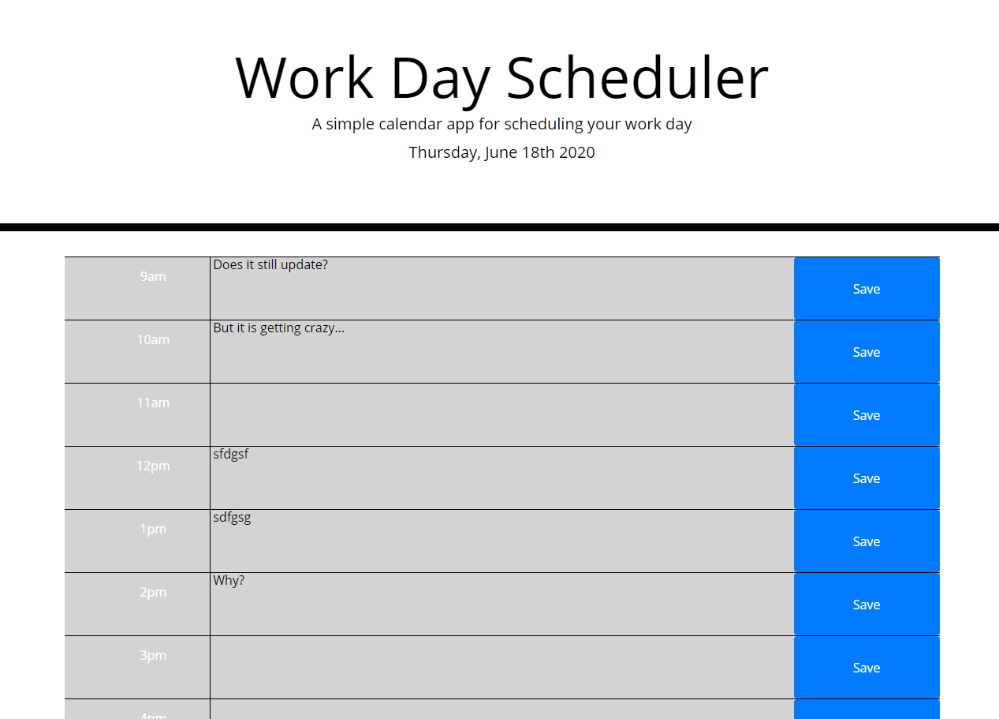

# workCalendar
The objective was to create a daily planner. We wanted the data to stay in the browser's local storage so that it could be retrieved when the site was visited again. 

I used bootstrap to create the grid layout. Then added the text-area and buttons to this grid. I was able to just use one listening function for all the buttons based on the ID. Then I update the text if it is changed. 

There are many areas for further development of this app. One would be that the data would expire at the end of the day or we could have something that continued to grow with each day. 

Deployed website: https://cloudflying87.github.io/workCalendar/
Github Repo: https://github.com/cloudflying87/workCalendar.git